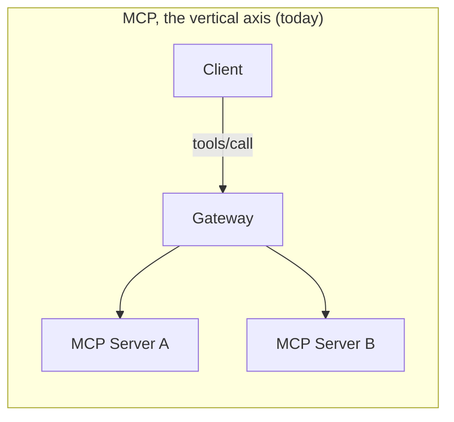
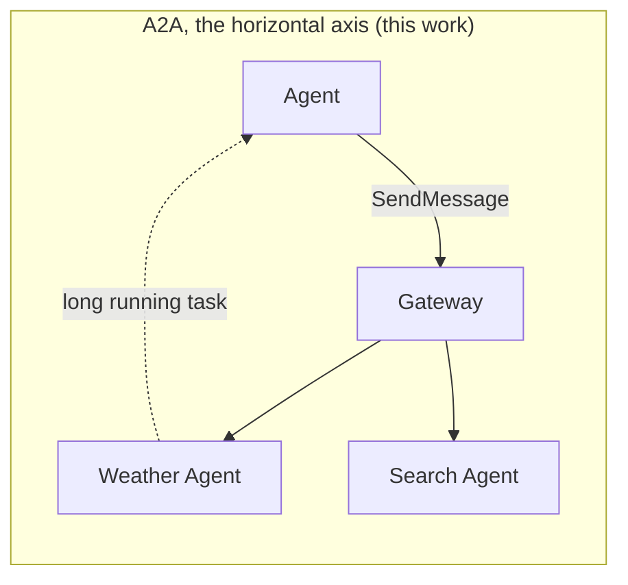

When two of your agents talk to each other, who's watching?

That question is where this whole piece of work started, and it turns out to be more uncomfortable than it sounds. We spend a lot of care putting a gateway in front of the tools our agents call.., auth on every request, rate limits, an audit trail, traces that stitch a call together end to end. And then two agents delegate work to each other over A2A, and all of that just… isn't there. The request goes agent to agent, straight past the gateway, outside the policy perimeter. No auth. No rate limit. No log line. Nothing.

I spent my CNCF LFX mentorship with the Kuadrant team closing a first piece of that gap, and the MCP Gateway now speaks a little bit of A2A. This is the story of the smallest useful version of that... what it does, why we deliberately built *less* than I first wanted to, and what you can do with it today.

### Two axes

Here's the way I ended up thinking about it. MCP is the **vertical axis** of an agentic system: one client reaching down into many tools, federated behind a single endpoint, every call wrapped in policy. That's what the MCP Gateway already does well.

But agentic architectures don't stay vertical. Agents start delegating to *other* agents ; a planner handing a long running research task to a specialist, agents discovering each other's capabilities, work that runs for seconds or days and streams results back. That's the **horizontal axis**, and that's what [A2A](https://a2a-protocol.org) standardizes: an open protocol (originally Google's, now under the Linux Foundation) for opaque agents to collaborate without sharing their internals.





A gateway that already routes one axis is halfway to routing both. The trick is doing it without turning A2A into a second, bolted on thing that the mature MCP path has to worry about.

### The temptation to build everything

I'll be honest about where I started, because the interesting part of this project was *not* building what I first designed.

I spent the early weeks proving out the whole thing in a fork.., agent registration via a CRD, the gateway serving each agent's card, a discovery catalog, routing requests to the right agent, tracking who owns which task, observing streamed task updates. It worked, end to end, on a real cluster. It was genuinely satisfying to watch a full A2A invocation flow through the gateway with policy attached.

And then, reviewing the upstreaming plan with my mentors, we pulled almost all of it back out.

The reasoning was better than my instinct to ship everything. A new CRD is a long term commitment, and where A2A support ultimately *lives* wasn't settled yet... locking in an API too early is how you end up maintaining something you regret. The broker was still churning on a new MCP spec version, so piling A2A changes on top meant rebasing against a moving target. And the mature MCP surface has real users ; the last thing anyone wanted was an experimental A2A feature introducing a regression into a path people depend on.

So we asked a sharper question: what is the *smallest* slice that delivers real value and touches almost nothing? The answer named itself: **A2A passthrough with auditing, auth and observability.** Router only. No CRD, no broker changes, no routing decisions. Just enough for the traffic to become *visible* to the policy plane.

That reframing is the part I'm proudest of, more than any code. It's easy to build a lot. It's harder to build the one piece that earns its place and defer the rest honestly.

### What the smallest useful version actually does

When you enable it (a single experimental flag, `--enable-a2a`, off by default) the router does one small thing for traffic on an `/a2a` path: it reads the A2A protocol metadata and lifts it into request headers.

Two headers, specifically:

- `x-a2a-agent` : which agent is being addressed, taken from the first path segment after `/a2a/`. The A2A request body doesn't name an agent, so the path is the only honest source, and it becomes a documented convention.
- `x-a2a-method` : the JSON-RPC method the caller is invoking (`SendMessage`, `GetTask`, `CancelTask`, and friends), read from the request envelope.

That's it. The router doesn't route the request, doesn't rewrite the body, doesn't touch the task ; your own HTTPRoute still carries the call to the agent. It just makes the two facts that matter, *which agent, which method*, available to everything downstream.

And once those facts are ordinary request headers, the entire Kuadrant policy plane wakes up for free. An `AuthPolicy` can authenticate the caller and authorize per agent.., the exact same pattern MCP already uses for per tool access. A `Telemetry` resource can put the agent and method into your access logs, so you finally have an audit trail of who called what. A `RateLimitPolicy` can throttle by agent. None of that needs a line of gateway code per policy ; it's all just Kuadrant reacting to headers, the way it already does for MCP.

### The details that took the most thought

The headline is simple. A few of the corners were not, and they're worth pulling out because they're where the design earns its keep.

**Nobody gets to forge these headers.** If a client could just *set* `x-a2a-agent` itself, the whole thing would be theatre ; a policy keying on that header would be trusting the attacker. So the router strips any client supplied `x-a2a-*` on the way in and sets its own. What a policy or an access log sees is always the router's value, derived from the request, never something the caller planted. (The client still *chooses* the path and method the router reads them from... so it's route matching and the AuthPolicy that decide what a given caller is *allowed* to reach. The headers describe the request ; they don't by themselves authorize it.)

**The method label is a bounded set, on purpose.** `x-a2a-method` is normalized: the known A2A methods pass through verbatim, and anything unrecognized collapses to `other`. That's not fussiness.., a client controlled string that becomes a metric dimension is an unbounded cardinality footgun, and `'; DROP TABLE tasks; --` has no business being a label value. Known, or `other`, keeps it safe to graph.

**It fails closed, not open.** Every request on an `/a2a` route is meant to be JSON-RPC. If a POST arrives that the router can't label (an unparseable body, or valid JSON with no method) it's rejected right there with a JSON-RPC error, rather than passed through unlabelled. A request that slipped to the agent *without* headers would quietly dodge exactly the auditing and authorization this feature exists to provide. Failing closed is the whole point.

**The hot path stays cheap.** The router only ever parses the JSON-RPC envelope, the method and the id, and never the params or the payload. On a streaming task carrying megabytes of artifacts, it reads a few dozen bytes and moves on. The broker and router are hot paths in this project, and this had to cost proportional to the envelope, not the body.

### Trying it

The shape is: point an HTTPRoute at your agent under an `/a2a/{agent}` path, turn on the flag, and attach the policies you already know how to write.

One thing that trips people up, so I'll say it plainly: the router lifts headers but does **not** rewrite the path. Your agent almost certainly serves its A2A endpoint at its own path (commonly `/a2a`), so your route needs a `URLRewrite` from `/a2a/{agent}` down to it ; the same rewrite the gateway will eventually do itself in a later phase. With that in place, a `SendMessage` to `/a2a/weather` traverses the router (which sets `x-a2a-agent: weather` and `x-a2a-method: SendMessage`), your route rewrites and forwards it, and your `AuthPolicy` gets to decide whether this caller may talk to `weather` before the request ever leaves the gateway.

The full walkthrough (the HTTPRoute, an AuthPolicy scoped to `/a2a/` POSTs, and a Telemetry that surfaces the headers in your logs) lives in the [A2A passthrough guide](https://github.com/Kuadrant/mcp-gateway/blob/main/docs/guides/a2a-passthrough.md).

And this is the whole point, really.., the line you get out the other end. With a JSON access log that includes the two headers, a `SendMessage` to `/a2a/weather` shows up as:

```json
{
  "method": "POST",
  "path": "/a2a/weather",
  "a2a_agent": "weather",
  "a2a_method": "SendMessage",
  "user_id": "planner-agent@acme.example",
  "response_code": 200,
  "duration_ms": 34
}
```

*which agent, which method, which caller, what happened*.., one structured line per inter agent call, in the same log stream as the rest of your gateway traffic. That's the audit trail that simply didn't exist before, and there was no gateway code written to produce it ; just Kuadrant reading headers.

### What this is, and what it isn't

This is experimental, off by default, and deliberately small. It doesn't discover agents, doesn't serve cards, doesn't route, doesn't own tasks. Those are real, and they're the next phases.., registration and discovery, then gateway side task ownership and streamed lifecycle observation. They already exist, proven, in the fork ; they land upstream as their own honest slices when the questions gating them (where A2A lives long term, the broker settling) are answered.

But even this smallest version changes something concrete: agent to agent traffic is no longer invisible. It picks up the same auth, the same audit trail, the same observability that the rest of your gateway traffic already has ; which, back at the question this started with, means *someone is watching* when two of your agents talk.

If you're running agents that delegate to each other and you'd like them inside the policy perimeter instead of outside it, I'd genuinely love to hear how it goes.., what works, what's awkward, what you'd want from the phases still to come.

---

*This work was done as part of a CNCF LFX mentorship with the Kuadrant team. Huge thanks to my mentors for the guidance.., especially for the review that talked me out of building too much at once.*
