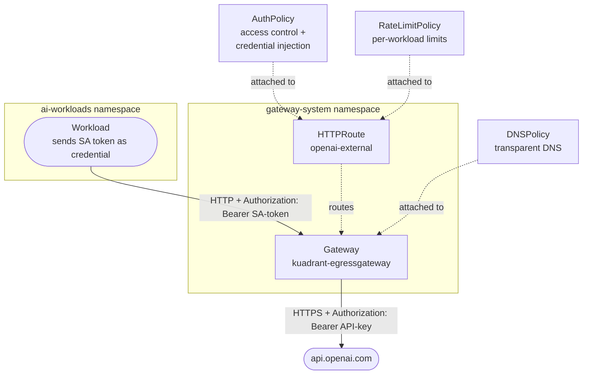
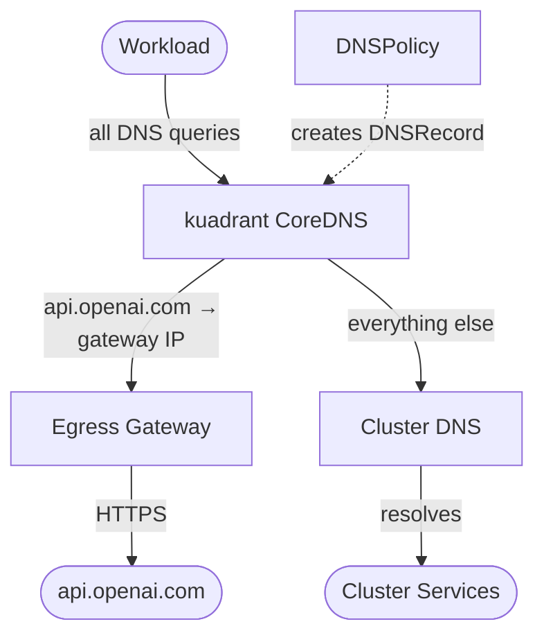
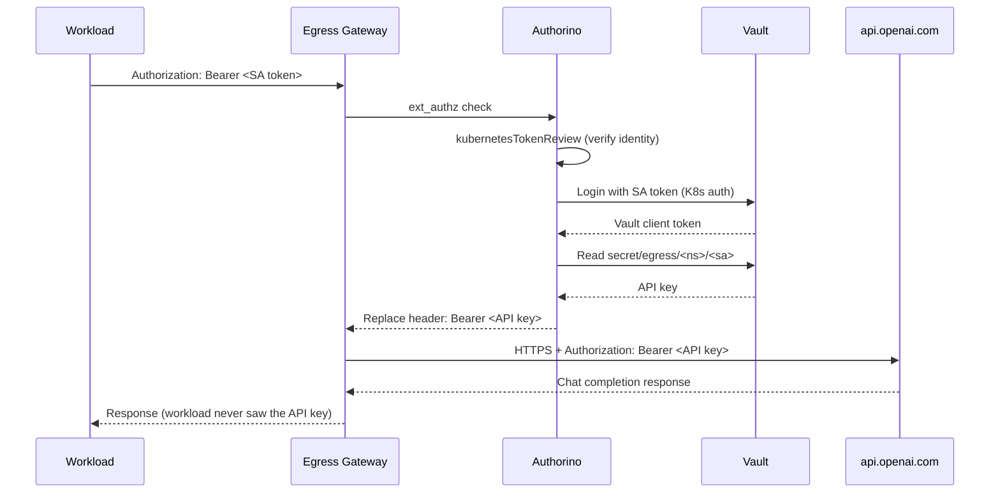

Kuadrant extends [Gateway API](https://gateway-api.sigs.k8s.io/) with policies for authentication, rate limiting, DNS, and TLS. With egress gateway support, these same policies now apply to **outbound** traffic — giving platform teams a unified, policy-driven way to manage how workloads connect to external services.

For AI workloads calling providers like OpenAI, Anthropic, or self-hosted inference endpoints, Kuadrant provides:

- **Access control** — Authenticate workloads by their Kubernetes identity and restrict which namespaces can reach which external APIs.
- **Rate limiting** — Per-workload request budgets to control API costs. Each team gets their own limit.
- **Credential injection** — Workloads send their Kubernetes ServiceAccount token; the gateway swaps it for the real API key from [HashiCorp Vault](https://developer.hashicorp.com/vault). No shared secrets, no key distribution.
- **Transparent DNS routing** — Optional [DNSPolicy](https://docs.kuadrant.io/latest/dns-operator/) configuration so workloads can call external hostnames directly without code changes.

The egress gateway itself is a standard [Gateway API Gateway](https://gateway-api.sigs.k8s.io/api-types/gateway/) backed by [Istio](https://istio.io/). No new APIs to learn — if you've used Kuadrant on ingress, you already know the model.

## How It Works

Kuadrant policies attach to standard Gateway API resources using the same `targetRef` mechanism as ingress. The egress gateway handles TLS origination — workloads send plain HTTP, the gateway upgrades to HTTPS toward the external service.



The AuthPolicy verifies the workload's Kubernetes identity, fetches the real API credential from Vault, and injects it into the outbound request. The RateLimitPolicy enforces per-workload rate limits. The DNSPolicy optionally resolves external hostnames to the gateway IP so workloads can call external APIs transparently.

## Prerequisites

- A Kubernetes cluster with Istio and Kuadrant installed — see the [installation guide](https://docs.kuadrant.io/latest/getting-started/)
- `kubectl` and `helm` CLIs configured
- An OpenAI API key (for the credential injection step)

## Set Up the Egress Gateway for OpenAI

Create the egress gateway and the Istio resources for routing traffic to api.openai.com. The Gateway provisions an Envoy proxy via Istio. The ServiceEntry registers the external hostname in Istio's service registry. The DestinationRule handles TLS origination — workloads send plain HTTP, the gateway upgrades to HTTPS. The HTTPRoute routes traffic to the external service:

```bash
kubectl apply -f - <<'EOF'
# Gateway — standard Gateway API resource, ClusterIP since traffic is internal
apiVersion: gateway.networking.k8s.io/v1
kind: Gateway
metadata:
  name: kuadrant-egressgateway
  namespace: gateway-system
  annotations:
    networking.istio.io/service-type: ClusterIP
spec:
  gatewayClassName: istio
  listeners:
    - name: openai
      port: 80
      protocol: HTTP
      hostname: api.openai.com
      allowedRoutes:
        namespaces:
          from: All
---
# ServiceEntry — registers api.openai.com in Istio's service registry
apiVersion: networking.istio.io/v1
kind: ServiceEntry
metadata:
  name: openai-external
  namespace: gateway-system
spec:
  hosts:
    - api.openai.com
  ports:
    - number: 443
      name: https
      protocol: HTTPS
  location: MESH_EXTERNAL
  resolution: DNS
---
# DestinationRule — TLS origination (workload sends HTTP, gateway upgrades to HTTPS)
apiVersion: networking.istio.io/v1
kind: DestinationRule
metadata:
  name: openai-external
  namespace: gateway-system
spec:
  host: api.openai.com
  trafficPolicy:
    tls:
      mode: SIMPLE
      sni: api.openai.com
---
# HTTPRoute — routes traffic to api.openai.com through the gateway
apiVersion: gateway.networking.k8s.io/v1
kind: HTTPRoute
metadata:
  name: openai-external
  namespace: gateway-system
spec:
  parentRefs:
    - name: kuadrant-egressgateway
      namespace: gateway-system
  hostnames:
    - api.openai.com
  rules:
    - filters:
        - type: URLRewrite
          urlRewrite:
            hostname: api.openai.com
      backendRefs:
        - group: networking.istio.io
          kind: Hostname
          name: api.openai.com
          port: 443
EOF
kubectl wait --for=condition=Programmed gateway/kuadrant-egressgateway -n gateway-system --timeout=120s
```

Export the gateway address for use in later commands:

```bash
export EGRESS_IP=$(kubectl get gtw kuadrant-egressgateway -n gateway-system \
    -o jsonpath='{.status.addresses[0].value}')
```

## Deploy Vault and a Test Workload

Deploy a [HashiCorp Vault](https://developer.hashicorp.com/vault) instance in dev mode with Kubernetes auth configured:

```bash
helm repo add hashicorp https://helm.releases.hashicorp.com
helm install vault hashicorp/vault \
    --create-namespace --namespace vault \
    --set "server.dev.enabled=true" \
    --set "server.dev.devRootToken=root" \
    --wait --timeout=300s

# Enable Kubernetes auth method
kubectl exec vault-0 -n vault -- vault auth enable kubernetes
kubectl exec vault-0 -n vault -- vault write auth/kubernetes/config \
    kubernetes_host="https://kubernetes.default.svc.cluster.local:443"

# Create a policy that allows reading egress credentials
kubectl exec vault-0 -n vault -- vault policy write egress-read - <<'EOF'
path "secret/data/egress/*" {
  capabilities = ["read"]
}
EOF
```

Create a namespace for AI workloads and deploy a test pod:

```bash
kubectl create namespace ai-workloads
kubectl apply -f - <<'EOF'
apiVersion: v1
kind: Pod
metadata:
  name: test-client
  namespace: ai-workloads
spec:
  containers:
    - name: curl
      image: curlimages/curl:8.12.1
      command: ["sleep", "infinity"]
  restartPolicy: Never
EOF
kubectl wait --for=condition=Ready pod/test-client -n ai-workloads --timeout=60s
```

Store your OpenAI API key in Vault and authorize the workload's namespace:

```bash
# Store the API key at the per-identity Vault path
kubectl exec vault-0 -n vault -- vault kv put secret/egress/ai-workloads/default \
    api_key="<your-openai-api-key>"

# Create a Vault role bound to the ai-workloads namespace
kubectl exec vault-0 -n vault -- vault write auth/kubernetes/role/egress-workload \
    bound_service_account_names=default \
    bound_service_account_namespaces=ai-workloads \
    policies=egress-read \
    ttl=1h
```

## Optional: Transparent DNS with DNSPolicy

One way to reach the egress gateway is by using its internal hostname and passing a `Host` header — no DNS configuration required. Another option is **transparent DNS routing** using [DNSPolicy](https://docs.kuadrant.io/latest/dns-operator/) and [kuadrant CoreDNS](https://github.com/kuadrant/dns-operator/blob/main/docs/coredns/coredns-integration.md), which lets workloads call `http://api.openai.com/...` directly without code changes.



Workload pods are configured with a custom `dnsConfig` pointing to kuadrant CoreDNS as their nameserver. Kuadrant CoreDNS resolves egress hostnames (like `api.openai.com`) to the gateway IP, and forwards all other queries — cluster services, external non-egress hostnames — to the cluster DNS. The DNSPolicy reads the Gateway's listener hostnames and status address, then publishes the DNS records to kuadrant CoreDNS automatically.

The Gateway listener in this guide already includes `hostname: api.openai.com`, which is what DNSPolicy needs to create the DNS record. For the full setup walkthrough — including CoreDNS deployment, Corefile configuration, DNSPolicy, and pod dnsConfig — see the [DNS Routing Guide](https://docs.kuadrant.io/dev/kuadrant-operator/doc/user-guides/egress/dns-routing/).

## Control Access with AuthPolicy

In egress, clients are internal workloads. Every pod in Kubernetes has a ServiceAccount token mounted automatically — no API keys to distribute. AuthPolicy uses [kubernetesTokenReview](https://kubernetes.io/docs/reference/kubernetes-api/authentication-resources/token-review-v1/) to verify the workload's identity and restrict access by namespace:

```bash
kubectl apply -f - <<'EOF'
apiVersion: kuadrant.io/v1
kind: AuthPolicy
metadata:
  name: openai-access-control
  namespace: gateway-system
spec:
  targetRef:
    group: gateway.networking.k8s.io
    kind: HTTPRoute
    name: openai-external
  rules:
    authentication:
      "workload-sa":
        kubernetesTokenReview:
          audiences:
            - "https://kubernetes.default.svc.cluster.local"
    authorization:
      "allowed-namespaces":
        patternMatching:
          patterns:
            - predicate: auth.identity.user.username.startsWith('system:serviceaccount:ai-workloads:')
EOF
```

This allows only workloads from the `ai-workloads` namespace to reach OpenAI. Add more patterns for additional namespaces. Requests without a valid token get 401; requests from unauthorized namespaces get 403.

## Rate Limit API Calls

RateLimitPolicy gives each workload its own API call budget, tracking by ServiceAccount identity:

```bash
kubectl apply -f - <<'EOF'
apiVersion: kuadrant.io/v1
kind: RateLimitPolicy
metadata:
  name: openai-rate-limit
  namespace: gateway-system
spec:
  targetRef:
    group: gateway.networking.k8s.io
    kind: HTTPRoute
    name: openai-external
  limits:
    per-workload:
      rates:
        - limit: 100
          window: 1m
      counters:
        - expression: "auth.identity.username"
EOF
```

Each ServiceAccount gets an independent 100 req/min bucket. `system:serviceaccount:team-a:default` and `system:serviceaccount:team-b:default` are tracked separately. Once a workload hits its limit, further requests get 429 until the window resets.

For AI workloads, you may also want to limit by **token consumption** rather than request count. Kuadrant's [TokenRateLimitPolicy](https://kuadrant.io/blog/token-rate-limiting/) counts tokens from OpenAI-compatible responses — e.g., 100,000 tokens per hour per workload.

## Inject Credentials from Vault

Credential injection takes egress policies a step further: workloads send their Kubernetes identity, and the gateway transparently injects the real API credential from [HashiCorp Vault](https://developer.hashicorp.com/vault).



This AuthPolicy replaces the access control policy above — it includes identity verification and adds Vault-based credential injection on top. Remove the previous AuthPolicy first:

```bash
kubectl delete authpolicy openai-access-control -n gateway-system
```

```bash
kubectl apply -f - <<'EOF'
apiVersion: kuadrant.io/v1
kind: AuthPolicy
metadata:
  name: openai-credential-injection
  namespace: gateway-system
spec:
  targetRef:
    group: gateway.networking.k8s.io
    kind: HTTPRoute
    name: openai-external
  rules:
    authentication:
      "workload-identity":
        kubernetesTokenReview:
          audiences:
            - "https://kubernetes.default.svc.cluster.local"
    metadata:
      vault_login:
        http:
          url: "http://vault.vault.svc.cluster.local:8200/v1/auth/kubernetes/login"
          method: POST
          contentType: application/json
          body:
            expression: '"{\"jwt\": \"" + request.headers.authorization.substring(7) + "\", \"role\": \"egress-workload\"}"'
        priority: 0
      vault_secret:
        http:
          urlExpression: '"http://vault.vault.svc.cluster.local:8200/v1/secret/data/egress/" + auth.metadata.vault_login.auth.metadata.service_account_namespace + "/" + auth.metadata.vault_login.auth.metadata.service_account_name'
          method: GET
          headers:
            X-Vault-Token:
              expression: 'auth.metadata.vault_login.auth.client_token'
        priority: 1
    authorization:
      vault_credential_check:
        patternMatching:
          patterns:
          - predicate: 'has(auth.metadata.vault_secret.data)'
    response:
      success:
        headers:
          authorization:
            plain:
              expression: '"Bearer " + auth.metadata.vault_secret.data.data.api_key'
EOF
```

**What each section does:**

- `authentication.workload-identity` — validates the workload's SA token via TokenReview.
- `metadata.vault_login` (priority 0) — authenticates to Vault using the SA token. Vault's [Kubernetes auth method](https://developer.hashicorp.com/vault/docs/auth/kubernetes) validates the token and checks `bound_service_account_namespaces`.
- `metadata.vault_secret` (priority 1, runs after vault_login) — reads the API key from a path built from the workload's namespace and service account: `secret/egress/<namespace>/<sa-name>`. Each workload identity gets its own credential.
- `authorization.vault_credential_check` — verifies the credential fetch succeeded. If Vault denies access, the request is rejected (403).
- `response.success.headers.authorization` — replaces the Authorization header with the real API key from Vault. The SA token never reaches OpenAI.

**Per-workload credentials** happen automatically. Store different API keys at different Vault paths and authorize the namespaces:

```bash
# Store per-team OpenAI keys
kubectl exec vault-0 -n vault -- vault kv put secret/egress/team-a/default \
    api_key=sk-team-a-key...
kubectl exec vault-0 -n vault -- vault kv put secret/egress/team-b/default \
    api_key=sk-team-b-key...

# Authorize both namespaces in the Vault role
kubectl exec vault-0 -n vault -- vault write auth/kubernetes/role/egress-workload \
    bound_service_account_names=default \
    bound_service_account_namespaces=ai-workloads,team-a,team-b \
    policies=egress-read \
    ttl=1h
```

Same AuthPolicy — each workload gets its own key based on its namespace and ServiceAccount.

## Test It

Deploy a test workload and send a real chat completion request. The workload sends its SA token; the gateway swaps it for the OpenAI API key from Vault.

**With DNSPolicy** (transparent DNS — workload calls api.openai.com directly):

```bash
kubectl exec test-client -n ai-workloads -- sh -c '
curl -s -H "Content-Type: application/json" \
    -H "Authorization: Bearer $(cat /var/run/secrets/kubernetes.io/serviceaccount/token)" \
    -d '\''{"model":"gpt-4o-mini","messages":[{"role":"user","content":"Say hello from Kubernetes"}]}'\'' \
    http://api.openai.com/v1/chat/completions
'
```

**Without DNSPolicy** (workload targets the gateway IP with a Host header):

```bash
kubectl exec test-client -n ai-workloads -- sh -c '
curl -s -H "Host: api.openai.com" \
    -H "Content-Type: application/json" \
    -H "Authorization: Bearer $(cat /var/run/secrets/kubernetes.io/serviceaccount/token)" \
    -d '\''{"model":"gpt-4o-mini","messages":[{"role":"user","content":"Say hello from Kubernetes"}]}'\'' \
    http://'"${EGRESS_IP}"'/v1/chat/completions
'
```

In both cases, the workload sends its Kubernetes identity. The gateway verifies it, fetches the real API key from Vault, and forwards the request to OpenAI over HTTPS. The response comes back to the workload — which never touched the API key.

An unauthorized workload from a different namespace is blocked by Vault — it has a valid Kubernetes identity, but Vault's `bound_service_account_namespaces` denies credential access:

```bash
kubectl run bad-client --image=curlimages/curl:8.12.1 -n default --restart=Never \
    --command -- sleep infinity
kubectl wait --for=condition=Ready pod/bad-client -n default --timeout=30s

kubectl exec bad-client -n default -- sh -c '
curl -s -o /dev/null -w "%{http_code}" \
    -H "Host: api.openai.com" \
    -H "Authorization: Bearer $(cat /var/run/secrets/kubernetes.io/serviceaccount/token)" \
    http://'"${EGRESS_IP}"'/v1/chat/completions
'
# 403

kubectl delete pod bad-client -n default
```

## What's Next

- **[TokenRateLimitPolicy](https://kuadrant.io/blog/token-rate-limiting/)** — rate limit by token consumption instead of request count. Set per-workload token budgets for AI inference cost control.

## Learn More

- [Egress Gateway User Guide](https://docs.kuadrant.io/dev/kuadrant-operator/doc/user-guides/egress/egress-gateway/) — full setup and policy reference
- [Credential Injection Guide](https://docs.kuadrant.io/dev/kuadrant-operator/doc/user-guides/egress/credential-injection/) — deep dive into Vault integration
- [DNS Routing Guide](https://docs.kuadrant.io/dev/kuadrant-operator/doc/user-guides/egress/dns-routing/) — internal hostname and CoreDNS approaches
- [RFC 0016: Egress Gateway](https://github.com/Kuadrant/architecture/blob/main/rfcs/0016-egress-gateway.md) — design and architecture
- [Kuadrant Community](https://kuadrant.io/community/) — join the conversation