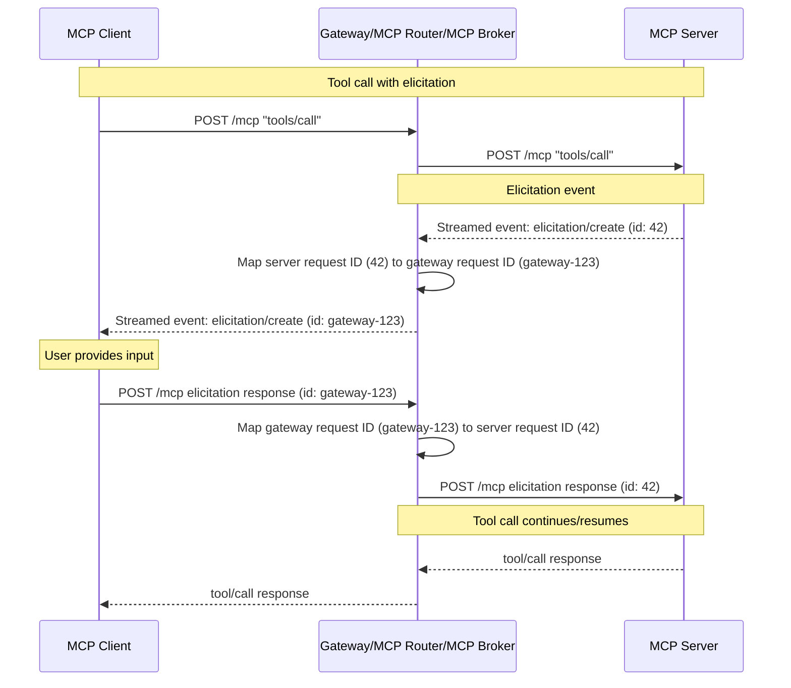

The [MCP Gateway](https://github.com/kuadrant/mcp-gateway) has reached its [0.6 tech preview release](https://github.com/Kuadrant/mcp-gateway/releases/tag/v0.6.0). This release adds a Kubernetes operator, MCP specification elicitation support, and Redis-backed horizontal scaling. For the full list of changes you can check out the [0.6.0 release page](https://github.com/Kuadrant/mcp-gateway/releases/tag/v0.6.0) on GitHub.

For background on the MCP Gateway, see the previous [0.5 dev preview announcement](/blog/mcp-gateway-dev-preview/) or the [overview documentation](https://docs.kuadrant.io/dev/mcp-gateway/docs/guides/overview/).

## From Dev Preview to Tech Preview

The 0.5 release was a dev preview, a first look at the core MCP Gateway functionality. With 0.6, the project moves to a tech preview as we work toward production readiness. APIs and interfaces may still change, but the foundations are now in place:

- **Installation** - OLM operator replaces Helm charts
- **Configuration** - declarative CRD (`MCPGatewayExtension`) replaces manual resource creation
- **Scaling** - Redis session store enables multi-replica deployments
- **Protocol** - elicitation support tracks the evolving MCP specification

## What's New in 0.6

### Kubernetes Operator and MCPGatewayExtension CRD

The 0.6 release adds an [OLM-based installation](https://docs.kuadrant.io/dev/mcp-gateway/docs/guides/olm-install/) alongside the existing Helm chart approach. The operator introduces the `MCPGatewayExtension` custom resource for configuring the MCP Gateway.

An `MCPGatewayExtension` targets a Gateway listener and configures the MCP routing layer:

```yaml
apiVersion: mcp.kuadrant.io/v1alpha1
kind: MCPGatewayExtension
metadata:
  name: mcp-gateway
spec:
  targetRef:
    group: gateway.networking.k8s.io
    kind: Gateway
    name: mcp-gateway
    namespace: gateway-system
    sectionName: mcp
```

The operator manages the MCP Router and Broker components, and (optionally) automatically creates `HTTPRoute` resources based on the `MCPGatewayExtension` configuration. Manual route definition is no longer needed.

See the [OLM install guide](https://docs.kuadrant.io/dev/mcp-gateway/docs/guides/olm-install/) to get started.

### MCP Specification Elicitation Support

This release adds support for the MCP protocol's [elicitation](https://modelcontextprotocol.io/specification/2025-11-25/client/elicitation) capability. Elicitation allows an MCP server to request additional information from the client during a tool call, enabling multi-turn exchanges between the agent and server. Below is a sequence diagram showing how elicitation events are mapped at the gateway between the client and server. Note the different request IDs on either side of the gateway, as the gateway abstracts this from the client. 



As the [MCP specification](https://modelcontextprotocol.io/) evolves, the MCP Gateway will continue to align its feature support with the spec. Teams adopting the gateway should not need to worry about protocol-level compatibility.

### Redis Session Store for Horizontal Scaling

The release also introduces a Redis-backed session store for horizontal scaling. When the MCP Gateway aggregates multiple MCP servers behind a single endpoint, it maintains session ID mappings between client sessions and upstream servers. The session store moves these mappings into Redis so that multiple gateway replicas can share state, removing the single-instance constraint from the dev preview.

Configure it via the `sessionStore` field in the `MCPGatewayExtension` spec:

```yaml
apiVersion: mcp.kuadrant.io/v1alpha1
kind: MCPGatewayExtension
metadata:
  name: mcp-gateway
spec:
  targetRef:
    group: gateway.networking.k8s.io
    kind: Gateway
    name: mcp-gateway
    namespace: gateway-system
    sectionName: mcp
  sessionStore:
    secretName: redis-credentials
```

With a session store configured, requests can be load-balanced across replicas without session affinity.

## What's Next

There will likely be additional releases before the MCP Gateway reaches GA with a 1.0. The [0.7 milestone](https://github.com/Kuadrant/mcp-gateway/milestone/5) includes a review of the virtual server API, tool search and discovery, and an investigation into how [A2A](https://google.github.io/A2A/) fits into the picture, among other items.

## Get Involved

- Try the [getting started guide](https://docs.kuadrant.io/dev/mcp-gateway/docs/guides/getting-started/).
- Report issues or request features on the [MCP Gateway Issues](https://github.com/kuadrant/mcp-gateway/issues) page.
- Engage with the [community](https://kuadrant.io/community/).
